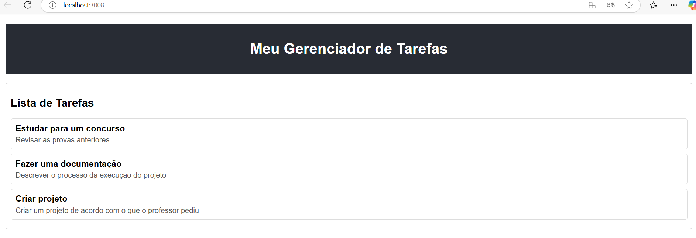

# Documentação do Projeto - Kayo Fernando


Este projeto utiliza React para criar uma aplicação simples de gerenciamento de tarefas. Abaixo está a descrição dos principais componentes e arquivos do projeto.


### 1. `App.js`

O componente principal que renderiza o layout básico da aplicação com dois containers:
- Cabeçalho (com o título do projeto).
- Seção de tarefas (onde as tarefas são exibidas).

```jsx
import React from "react";
import Header from "./components/Header";
import TaskContainer from "./components/TaskContainer";

function App() {
  return (
    <div style={{ fontFamily: "Arial, sans-serif", padding: "20px" }}>
      {/* Cabeçalho */}
      <Header />

      {/* Seção de Tarefas */}
      <main style={{ marginTop: "20px" }}>
        <TaskContainer />
      </main>
    </div>
  );
}

export default App;
```

### 2. `Header.js`

É o componente responsável por renderizar o título do projeto dentro do cabeçalho.

```jsx
import React from "react";

function Header() {
  return (
    <header style={{ backgroundColor: "#282c34", padding: "15px", color: "white", textAlign: "center" }}>
      <h1>Meu Gerenciador de Tarefas</h1>
    </header>
  );
}

export default Header;
```

### 3. `TaskContainer.jsx`

Ele é o componente responsável por renderizar a lista de tarefas, utilizando o componente `Task` para exibir cada uma delas.

```jsx
import React from "react";
import Task from "./Task";

function TaskContainer() {
  const tarefas = [
    { title: "Estudar React", description: "Revisar os hooks useState e useEffect." },
    { title: "Ler documentação", description: "Ler a documentação oficial do React." },
    { title: "Criar projeto", description: "Iniciar um novo projeto React para praticar." },
  ];

  return (
    <section style={{ border: "1px solid #ccc", borderRadius: "5px", padding: "10px" }}>
      <h2>Lista de Tarefas</h2>
      {tarefas.length === 0 ? (
        <p>Ainda não há tarefas. Adicione uma para começar!</p>
      ) : (
        <div>
          {tarefas.map((tarefa, index) => (
            <Task key={index} title={tarefa.title} description={tarefa.description} />
          ))}
        </div>
      )}
    </section>
  );
}

export default TaskContainer;
```

### 4. `Task.js`

Ele é o componente que recebe props para renderizar o título e a descrição de uma tarefa.

```jsx
import React from "react";

function Task({ title, description }) {
  return (
    <div style={{ border: "1px solid #ddd", borderRadius: "5px", padding: "10px", marginBottom: "10px" }}>
      <h3 style={{ margin: "0 0 5px 0" }}>{title}</h3>
      <p style={{ margin: "0", color: "#555" }}>{description}</p>
    </div>
  );
}

export default Task;
```

